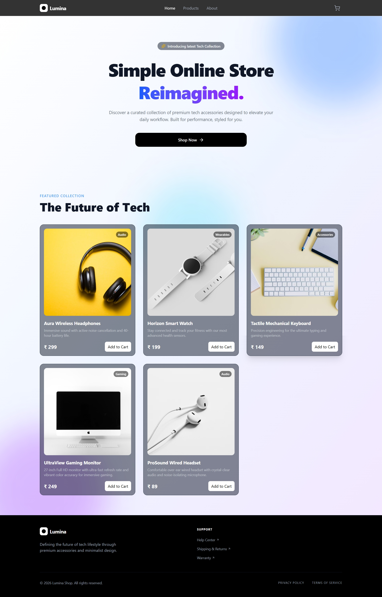
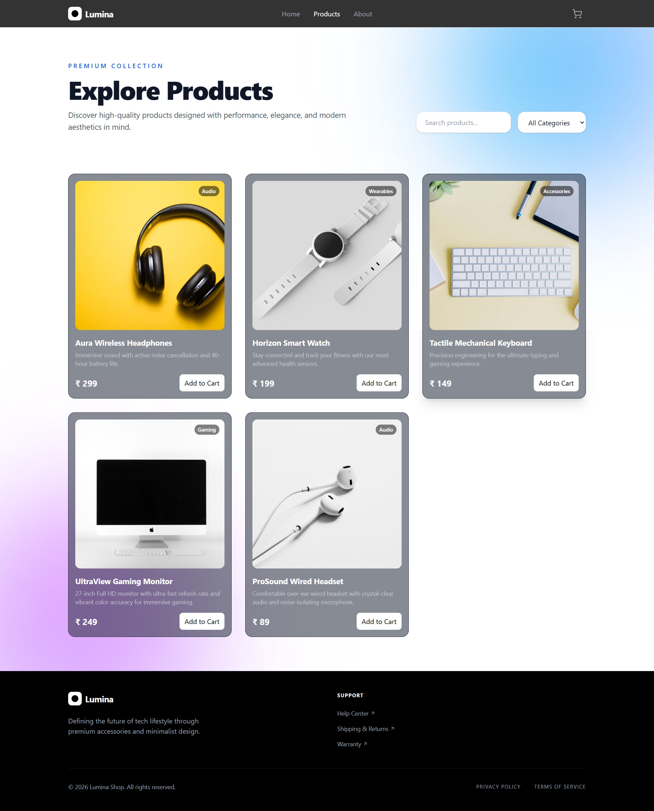
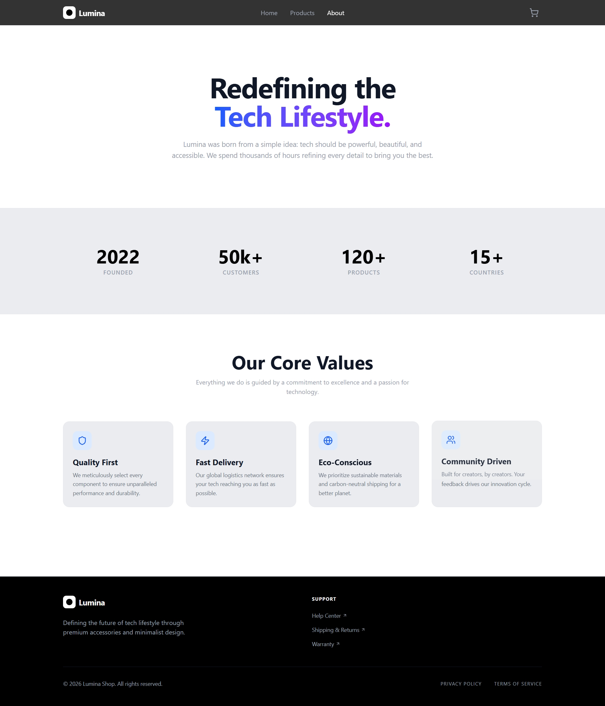
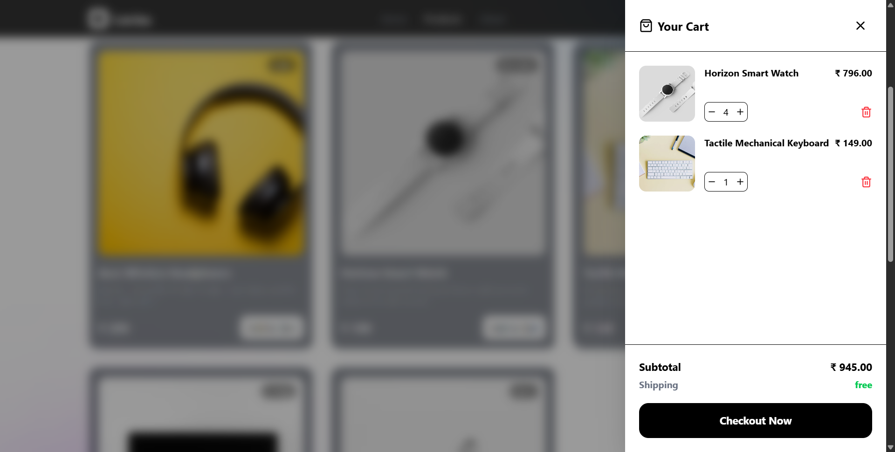
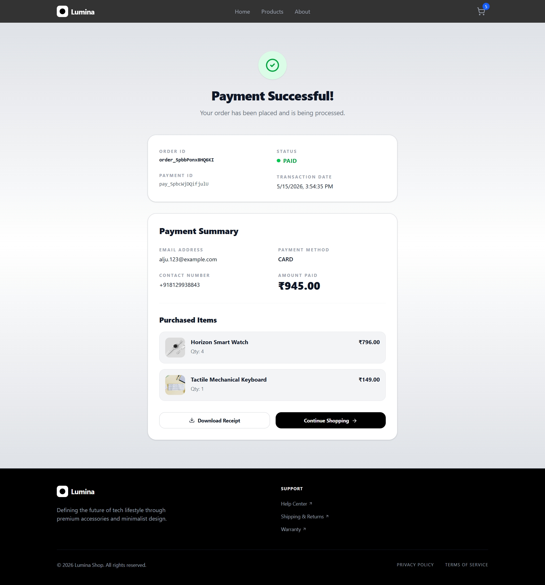

# Lumina E-Commerce Store

A modern full-stack e-commerce web application built using the MERN stack with Razorpay payment integration. The project features a responsive UI, animated interactions, shopping cart functionality, and secure online payments.

---

# 🚀 Live Demo

🔗 **Live Website:** `PASTE_YOUR_LIVE_LINK_HERE`

# 📸 Project Screenshots

## 🏠 Home Page




---

## 🛍️ Products Page




---

## ℹ️ About Page




---

## 🛒 Cart Drawer





---

## 💳 Razorpay Checkout




---

# ✨ Features

- Modern responsive UI
- Fully functional shopping cart
- Quantity management system
- Dynamic cart total calculation
- Razorpay payment gateway integration
- Animated cart drawer using Framer Motion
- Mobile responsive navigation
- React Context API state management
- Product listing system
- Smooth UI interactions
- Clean Tailwind CSS design

---

# 🛠️ Tech Stack

## Frontend

- React.js
- Tailwind CSS
- Framer Motion
- React Router DOM
- Axios
- Lucide React Icons

## Backend

- Node.js
- Express.js
- Razorpay API
- dotenv
- cors

---

# 📂 Folder Structure

```bash
Payment_Gateway-main/
│
├── client/
│   ├── src/
│   ├── public/
│   └── package.json
│
├── routes/
├── controllers/
├── server.js
├── package.json
└── README.md
```

---

# ⚙️ Installation & Setup

## 1️⃣ Clone the Repository

```bash
git clone https://github.com/AljuSabu/Payment_Gateway
```

---

## 2️⃣ Navigate to Project Folder

```bash
cd Payment_Gateway-main
```

---

## 3️⃣ Install Dependencies

### Backend

```bash
npm install
```

### Frontend

```bash
cd client
npm install
```

---

## 4️⃣ Create Environment Variables

Create a `.env` file in the root directory and add:

```env
PORT=5000
RAZORPAY_API_KEY=YOUR_KEY
RAZORPAY_API_SECRET=YOUR_SECRET
```

---

## 5️⃣ Run the Project

### Start Backend + Frontend Together

```bash
npm run dev
```

---

# 💳 Razorpay Payment Integration

This project uses Razorpay for handling secure online payments.

Features included:

- Payment order creation
- Razorpay checkout popup
- Payment verification
- Real-time checkout handling

---

# 📱 Responsive Design

The application is fully responsive and optimized for:

- Mobile devices
- Tablets
- Desktop screens

---

# 🎨 UI Highlights

- Smooth Framer Motion animations
- Animated cart drawer
- Interactive hover effects
- Clean typography
- Mobile-friendly navigation menu

---

# 📌 Future Improvements

- User authentication
- Order history
- Wishlist feature
- Admin dashboard
- Product search & filters
- Database integration
- Dark/light theme toggle

---

# 👨‍💻 Author

## Alju Sabu

- GitHub: [AljuSabu](https://github.com/AljuSabu)

---
